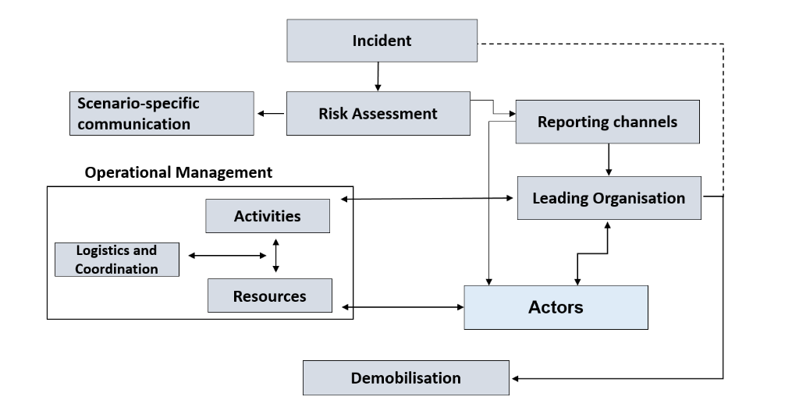
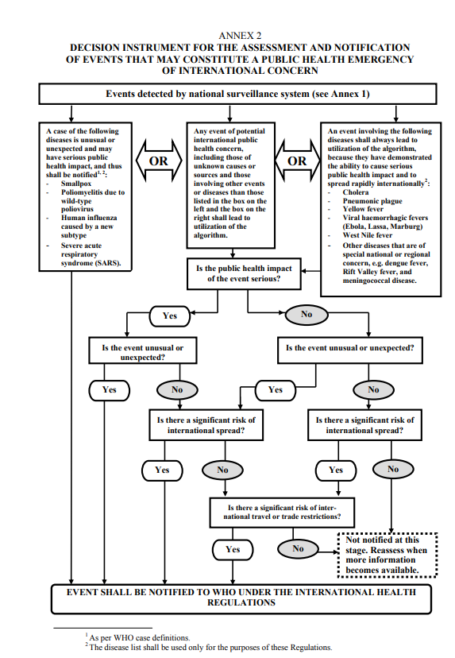

CRI002: Operational planning

## Abstract

This chapter presents the specifics of operational planning for public health
authorities in case of biological emergencies, and introduces some principles.

In Germany, responsibility for drawing up operational plans for biological
emergencies rests with the national government, federal states (regions) and
municipalities. There are no standard rules for drawing up these plans. However,
there are framework plans at national level, e.g. [Influenza pandemic
planning](https://www.rki.de/DE/Content/InfAZ/I/Influenza/Pandemieplanung/Pandemieplanung_Node.html),
and [Supplements to the national pandemic plan – COVID 19 – new coronavirus
disease](https://www.rki.de/DE/Content/InfAZ/N/Neuartiges_Coronavirus/Ergaenzung_Pandemieplan_Covid.html)
or [Suspected cases of
Ebola](https://www.rki.de/DE/Content/InfAZ/E/Ebola/Rahmenkonzept_Ebola.pdf).
These were drawn up by the Robert Koch Institute in consultation with other
bodies.

Apart from this, the (higher) regional health authorities in some federal states
have drawn up plans for viral haemorrhagic fever (VHF), infection alert plans
and plans for high consequence infectious diseases (HCID). All federal states
have drawn up plans for influenza pandemics. In addition, the ministries of the
interior in the federal states have produced alert and operational plans for
disaster risk management. All of these plans can serve as a basis for specific
plans at regional level.

Operational plans for crisis situations often take the form of legal
regulations. When operations are underway these are difficult to read, and they
are not structured as they would need to be for application in the field. Often
no electronic systems are used to draw the operational plans. Creating and
maintaining them by hand is a time-consuming process. Updating them is therefore
costly. As a result the plans are not always up-to-date.

The staff involved need to be familiarised with the content of the plans through
training before operations take place, and if possible should first be able to
try things out in drills.

**N.B.: Plans can only be successfully implemented if content is regularly
updated and users are trained to apply it.**

## Objectives of successful operational planning

An operational plan should describe possible measures that need to be
implemented by the staff of a public authority in a special situation, e.g. the
hazards that arise in case of an epidemic.

Operational plans must contain up-to-date information, be self-explanatory and
have a uniform structure. Complicated and poorly structured plans are not fit
for purpose. In practice, checklists and flowcharts have proven helpful as they
make it easier to understand the processes, and provide rapid orientation during
a crisis.

Structuring operational plans as shown below has proved successful:

Figure 1: *Structure of an operational plan*

The graphic shows individual points in an operational plan in the form of a flow
diagram. The points can be used to structure an operational plan.

An explanation of each point is given below.

## Risk assessment

In addition to the general risk assessment that (sub-regional) administrative
districts/independent cities or federal states (regions) are obliged to carry
out in the context of population protection, the responsible public health
offices should conduct a corresponding subject-specific [risk
assessment](https://www.bbk.bund.de/SharedDocs/Downloads/BBK/DE/Publikationen/Praxis_Bevoelkerungsschutz/PiB_16_Risikoanalyse_im_Bevoelkerungsschutz.pdf)
for their region as a precautionary measure.

On the basis of this risk assessment, the public health authority must carry out
an incident-specific analysis before any operational measures are commenced.
Other authorities are to be involved as required. In such a risk analysis, the
following factors can be taken into account:

1.  Number of persons affected

2.  Mortality/lethality

3.  Local spread

4.  Likelihood of spread

5.  Dynamics of spread

6.  Type of agent (biological, chemical...)

## Scenario-specific communication

For communication with partners, the general public and the press, it is
essential in particular emergency scenarios to specify who is responsible for
coordination and deciding which strategies are implemented, and which other
authorities and institutions must be involved. It is also important to set out
the fundamental objectives of communication, the specific content, the
instruments employed in press work, and the target groups. (**see chapter:
Communications**)

As well as communication with external partners, it is important to remember
that staff of public authorities also have to be informed. In a crisis, everyone
should have sufficient information in order to promote general understanding of
the exceptional circumstances when the work situation is tense.

## Alert system

In an emergency, the regional health authorities are generally notified
(alerted) by the responsible coordination centres; (higher/lower) regional
health authorities are often notified by central bodies, e.g. the police
operations centre.

In the public health authorities, it is important to plan the internal alert
and/or notification procedures for in-house staff and, if necessary, for other
institutions that are to be involved. It makes sense to make use of existing
alert systems in the authorities. Depending on the circumstances, it may be
possible to set up alert contact groups at third parties, e.g. the fire service
operations centre, so that staff at public health offices can be notified
automatically without the need for further action. Alert and notification lists
must be regularly updated. Alert drills can be used to test whether professional
and private contact data are up to date.

## Notification channels

When crisis-like incidents occur, the early recognition, validation and
assessment of the situation is key to the rapid introduction of specific control
and prevention measures. Pursuant to Article 6 of the [International Health
Regulations](https://www.rki.de/DE/Content/Infekt/IGV/Gesetz_IGV_de-en.pdf)
(IHR) and pursuant to Article 9 of [Decision No. 1082/2013/EU of the European
Parliament and of the Council of 22 October 2013 on serious cross-border
threats](https://eur-lex.europa.eu/legal-content/EN/TXT/?uri=celex%3A32013D1082),
Germany is legally obliged to immediately notify the international community of
any events that may constitute a public health emergency of international
concern or a serious cross-border threat to health. This notification provides
early warning, as well as information for rapid assessment and early warning of
all actors, and where appropriate joint coordination. It is provided by the
public health office to the national (federal) authority, via the responsible
regional authority.

The responsible national authority is

1.  for biological events the RKI

2.  for chemical events the BBK

3.  for radiological/nuclear events the BMU.

For [notifications of biological
events](https://www.rki.de/DE/Content/Infekt/IfSG/Meldeboegen/Meldung_12/meldung_12_node.html)
the
RKI provides a notification form; a form for
[notification](https://www.bbk.bund.de/SharedDocs/Kurzmeldungen/BBK/DE/2017/IGV_Meldebogen_Info_WHO_Chemie.html)
[of
chemical
hazards](https://www.bbk.bund.de/SharedDocs/Kurzmeldungen/BBK/DE/2017/IGV_Meldebogen_Info_WHO_Chemie.html)
is provided by the BBK.

Pursuant to IHR Annex 2 (see Figure 2), cases of smallpox, poliomyelitis (due to
wild-type poliovirus), human influenza (caused by a new subtype) and severe
acute respiratory syndrome (SARS) must be notified.

>   'On 30 January 2020 the WHO declared the outbreak (of COVID-19) a public
>   health emergency of international concern, and saw a compelling need to step
>   up internationally coordinated efforts to control the outbreak in accordance
>   with the International Health Regulations (IHR), also to better support
>   countries with weaker health systems.' (COVID-19, information for employees
>   and travellers, German Federal Foreign Office, 28 February 2020)

Cases of cholera, yellow fever, pneumonic plague, viral haemorrhagic fever or
West Nile fever, as well as other events of potential international public
health concern, must be notified to the WHO under certain circumstances.

Figure 2: Decision instrument for the assessment and notification of events
under the IHR (source: WHO)

The public health office notifies the national level via the competent regional
authority if there is a mere possibility that an event might constitute a public
health emergency of international concern according to the criteria of Annex 2
to the IHR.

The final assessment of whether an event must be notified to the World Health
Organization or the competent authorities of the European Union is made by the
competent national authority

## Management structure

Staff at the public health authorities involved must be informed about the
general management organisation structure in the case of large-scale emergencies
and disasters (**see chapter: Working in teams**).

The operational plans of the public health authorities involved must specify who
has management responsibility in particular scenarios. This responsibility must
be clearly stated. If several authorities are involved, the areas of
responsibility must be clearly defined.

In on-site assignments, it makes sense if the manager of the public health
office can be recognised by all involved, e.g. by means of a vest.

## Actors and tasks

Depending on the scenario, different actors – individuals and institutions –
with different responsibilities will called on to respond to a particular
incident. The operational plan must clearly show which actors are responsible
for which tasks. It is also important to specify who is to coordinate particular
tasks and which actors also play an active role.

## Measures to be taken in an emergency

The measures undertaken depend on the respective scenario. A series of
recommendations for action is presented in the toolbox of this textbook (**see
chapter: Toolbox**).

Particular measures may be required by statutory regulations. In the public
health services sector in Germany, these requirements follow from the Protection
against Infection Act, the German Drinking Water Ordinance and the public health
laws in the federal states. Other measures, also those not based on statutory
requirements, must be specified individually in the operational plan.

Not all measures will necessarily be implemented in a real emergency scenario.
On the other hand, other measures will be needed spontaneously and may not have
been planned in advance.

The textbook's toolbox offers an array of options, from which the user can make
the right selection as required. Measures that have not been documented/outlined
must be flexibly organised and implemented by the responsible team.

## Logistics and coordination

The coordination of logistics measures in an emergency can tie up many
personnel. Test samples and disposal management for example can be considered as
logistics tasks. For this reason, the focus of good operational planning should
lie in this area in order to alleviate the burden in a crisis.

## Resources

In some situations the resources required are provided by third parties These
include hospital care facilities, the availability of vaccines and antidotes.
Information on who will provide what, and when, should be included in
operational plans, as making enquiries during a crisis costs a great deal of
time and therefore must be avoided at all costs.

On the other hand, certain materials that are not available in an emergency or
that may quickly be in short supply should be stocked by the health authorities.
One important example is personal protective equipment (PPE).

## Checklists for emergencies

One useful and important measure to keep things running smoothly are checklists
that lay down in writing what information is required or needs to be obtained,
and when. One good example is checklists in aviation, which pilots go through
before take-off.

In a crisis, checklists enable us to act with confidence, which is important.
They enable us to review our intuitive actions and check that the measures we
have taken are complete. The handbook provides checklists at various points to
support the heath authorities that need to act.

## Bibliography
