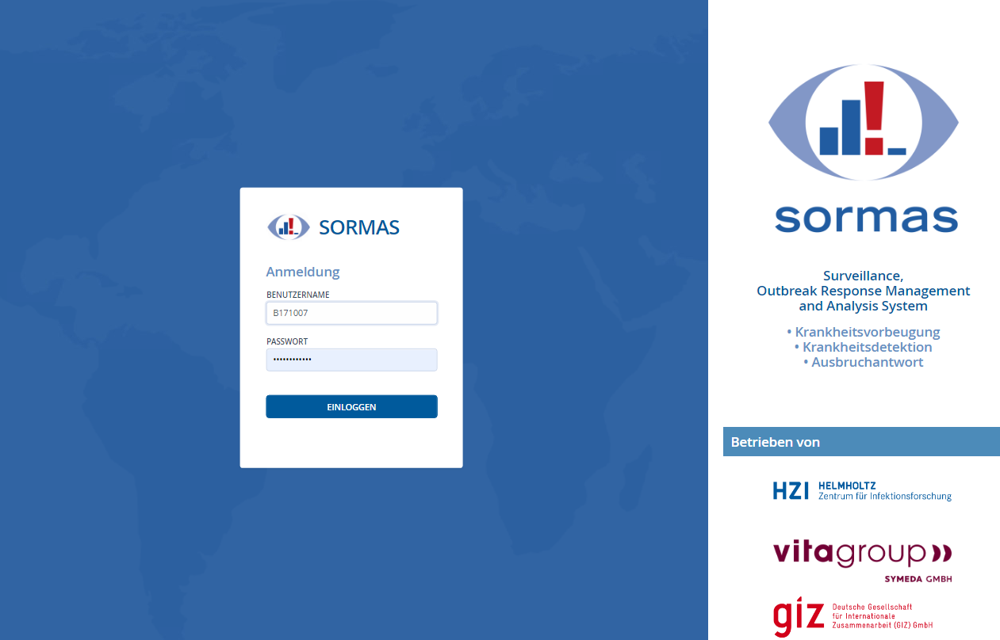
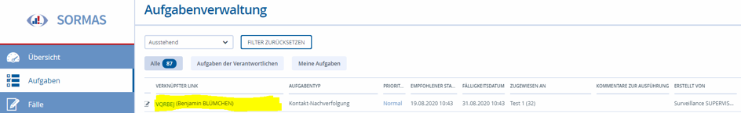
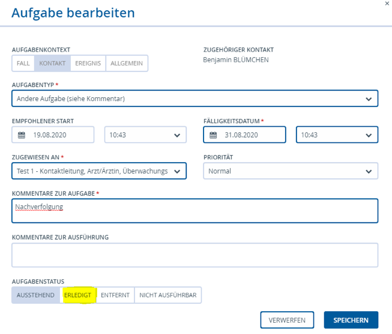
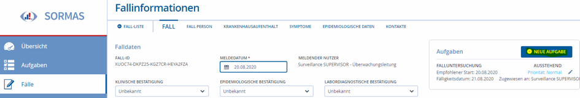
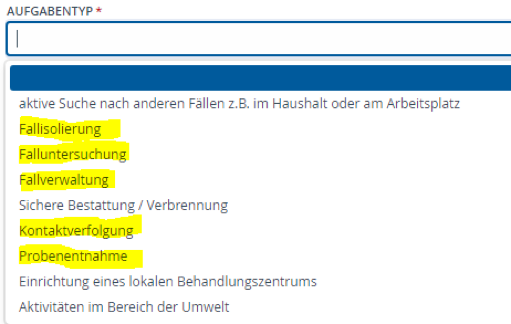

# Allgemeine Informationen

Im Corona-Team des Gesundheitsamt Nordfriesland (GA NF) arbeiten Kollegen/innen
aus unterschiedlichen Bereichen - und mit unterschiedlichen Qualifikationen -
zusammen. Sie nehmen unterschiedliche Verantwortungen in verschiedenen Rollen
war:

1.  Fallbeauftragte (Ermittler/innen, Spezis)

2.  Kontaktbeauftragte

3.  Laborbeauftragte

4.  Verwaltung

5.  Hotline

6.  Team Recht

### Fallbeauftragte (Spezi)

Ein/e **verantwortliche/r** Fallbeauftragte/r ist täglich verantwortlich für den
Ablauf der Ermittlungen und die Arbeitsaufträge. Diese Person ist auch über das
sogenannte „Corona-Handy“ (8-20 Uhr) zu erreichen und damit u.a. unmittelbarer
Ansprechpartner /in für die Pressestelle, Rettungsleitstelle etc. Sie/er stellt
sicher das ausreichend Mitarbeiter/innen als Fall-bzw. Kontaktbeauftragte im
Team anwesend sind und alamiert - nach eigenem Ermessen - wenn notwendig weitere
Mitarbeiter/innen nach. Sie/er informiert bei besonderen Vorkommnissen, z.B.
Ausbrüchen in Alten-/Pflegeheimen, in Schulen, etc. die Leitung des
Gesundheitsamtes und stimmt mit diesem das weitere Vorgehen ab. Dazu werden o.g.
Sachverhalte zunächst selbst gesichtet.

Innerhalb des Teams der Fallbeauftragten (Spezis) sollte immer ein/e Ärztin/Arzt
vertreten sein um ausreichende medizinische bzw. hygienische Fachkenntnis
sicherzustellen.

1.  Aufgaben der Fallbeauftragten sind insbesondere

2.  Bewertung von Laborergebnissen,

3.  Entscheidung über Anordnungen und Einleitung von Schutzmaßnahmen,

4.  Verteilung der Aufgaben an die anderen Mitarbeitenden im Corona-Team bei
    einem Ausbruch,

5.  Befragung der positiv getesteten Personen nach Kontaktpersonen.

### Kontaktbeauftragte

Das Team der Kontaktbeauftragten ist verantwortlich für die
Kontaktpersonennachverfolgung (KPN) und wird Anweisung des
Fallbeauftragten(Spezi)-Team tätig und arbeitet diesem zu.

Zu den Aufgaben gehören

1.  Anrufe bei Kontaktpersonen,

2.  Ermittlungen von Kontaktpersonen Kategorie 1 und 2,

3.  Vorbereitung von Entscheidungen des Fallbeauftragten(Spezi)-Teams und

4.  Erledigung von organisatorischen Aufgaben (Führen von To-Do-Listen, Zuarbeit
    bei Pressearbeit etc.).

### Laborbeauftragte

Tägliche arbeiten zwei Personen als Laborbeauftragte. Das Team ist so
zusammenzusetzen, dass stets beide Aufgaben (gemeinsam oder auch einzeln)
erfüllt werden können.

Ihre Aufgaben umfassen:

1.  Abstriche organisieren und/oder

2.  Abstriche durchführen.

### Verwaltung

Die Mitarbeitenden übernehmen v.a. Verwaltungstätigkeiten wie z.B.

1.  Ausfertigung von besonderen Anordnungen,

2.  Erstellen von Statistiken,

3.  Unterstützung der Leitung bei Öffentlichkeitsarbeit,

4.  allgemein Informationsbeschaffung

### Hotline

Die Mitarbeiter/innen der Hotline bearbeiten eingehende Anrufe.

(Sie führen auch den täglichen Rückruf bei den Personen in häuslicher
Absonderung (Quarantäne) durch, wenn dieses der Arbeitsaufwand zu lässt.)

### **Team Recht**

Das Teams Recht steht täglich grundsätzlichen zur Verfügung für
Rechtsberatungen.

## SORMAS

In SORMAS werden Arbeitsabläufe durch digitale Arbeitsprozesse und Aufgaben
ersetzen, um den Ablauf bei der Ermittlung von Infektionsketten und in der
Kontaktpersonennachverfolung zu vereinfachen.

Im folgenden stellen wir Ihnen die Arbeitsabläuf vor und wie wir SORMAS nutzen.

### Anmeldung

Für die Bearbeitung in SORMAS benutzen Sie bitte immer den Internet Browser
**Google Chrome**, die Anwendung ist für diesen Browser optimiert.

Um die internetbasierte Anwendung nutzen zu können benötigen einen
individualiserten Nutzer/innenzugang mit dem Sie sich anmelden unter der
**Internetaddresse**

[http://kreis-nordfriesland.sormas-oegd.de/sormas-ui/login\#](http://kreis-nordfriesland.sormas-oegd.de/sormas-ui/login)

### Startseite

Unter o.g. Internetaddresse finden Sie die folgende Startseite:

Foto 1

Melden Sie sich hier an mit Ihrem **Benutzernahme** (B-Kennung der KommunIT) und
Ihrem dazugehörigen **SORMAS Passwort** (dieses erhalten Sie von Hernn
Heiko.Tiedemann\@nordfriesland.de).

Nach der Anmeldung finden Sie die Startseite für die
Kontaktpersonennachverfolgung des Landkreises Nordfriesland.

Foto 2

Unter Aufgaben finden Sie an Sie persönlich oder an das Team in dem Sie arbeiten
delegierte Arbeitsaufträge.

### Pflichtfelder

In den Eingabemasken sind viele Felder mit „\*“ gekennzeichnet. Bei diesen
Feldern handelt es sich um Pflichtfelder die ausgefüllt werden müssen.

### Orientierung

Bitte immer orientieren, in welchem Menü-Bereich man Sie sich befindet. Auf der
**linken Seite** der Software finden Sie dazu das Blaues Menu mit

Übersicht, Aufgaben, Fälle, Kontakte, …

Auf der **rechten Seite** finden sie oben unterschiedliche unter
Menuepunkte/Reiter zu den entsprechenden Bereichen für die Dateneingabe, z.B.
unter Menue Fälle, Reicher: Fallverzeichnis, oder im Untermenue eines einzelnen
Falles: Fallinformationen: Fall, Fall Person, Krankenhausaufenthalte, Symptome,
Epidemioligische Daten...

## Aufgaben

Zur Sicherstellung, dass im Bearbeitungsprozess die nächsten Schritte bearbeitet
werden gibt es in SORMAS die Möglichkeit sogenannte "Aufgaben" als
Arbeitsaufträge für Personen oder Gruppen zu definieren.

Einzelne Aufgaben stehen jeweils am Ende eines Arbeitsschrittes, bzw. leiten den
nächsten Arbeitsschritt ein.

### Aufgaben abrufen

Jedes Team, bzw. jede Person ist für die ihm zugewiesenen Aufgaben
verantwortlich. Diese Aufgaben müssen täglich abgearbeitet werden.

Hierzu werden die Aufgaben durch Klicken auf „Zugewiesen an“ alphabetisch
sortiert und können nun einzeln geöffnet werden.

Foto 3: Aufgaben verwalten

### Aufgaben öffnen

Wird ein Doppelklick auf die einzelnen Aufgaben gemacht, öffnet sich der Fall
bzw. der Kontakt für den die Aufgabe angelegt wurde. Durch Doppelklick auf den
hinteren Bereich der Aufgabe gelangt man direkt in die Aufgabe.

Foto 4: Aufgaben öffnen

### Aufgabe abschließen

Wurde eine Aufgabe abgeschlossen, wird diese Aufgabe als „Erledigt“ markiert.
Dadurch taucht die Aufgabe nicht mehr in der Übersicht der Aufgaben auf.

Foto 5: Aufgabe als ERLEDIGT abschließen

### Aufgabe anlegen

Um eine **neue Aufgabe** anzulegen, wird bei der Bearbeitung eines "Fall" oder
"Kontaktes" rechts oben auf „Neue Aufgabe" geklickt.

Foto 6

In der geöffneten Eingabemaske wird ein **Aufgabentyp gewählt**, das
**Fälligkeitsdatum** ggfs. angepasst und die **Aufgabe zugewiesen an** eine
Person oder ein Team. In dringenden Fällen kann die **Priorität** auf „Hoch“
gesetzt werden, dann wird sie optisch in der Aufgabenverwaltung hervorgehoben.
In dem Feld "Kommentar zur Aufgabe" werden alle wichtigen Informationen zu der
Aufgabe beschrieben/dokumentiert.

Foto 7

Die gebräuchlichsten Aufgabentypen sind:

Foto 8: 1: 3: Unterschiedliche Aufgabentype, die Arbeitsaufträge enthalten und
entsprechend von unterschiedlichen Teams bearbeitet werden

| **Aufgabentyp**   | **ToDo**                                                                 | **Adressat (i.d.R.)**     |
|-------------------|--------------------------------------------------------------------------|---------------------------|
| Fallisolierung    | Positiv gemeldete Person **wird als Fall isoliert**                      | Verwaltung                |
| Falluntersuchung  | Positiv gemeldete Person wird kontaktiert und die Umstände ermittelt     | Ermittler ("Spezi"-Team)  |
| Fallverwaltung    | Zu einem positiv gemeldeten Fall werden Daten aufbereiten/ recherchieren | Verwaltung (Survnet-Team) |
| Kontaktverfolgung | Umfeld ermitteln                                                         | KPN                       |
| Probenentnahme    | Probe organisieren                                                       | Abstrichteam              |
| Andere Aufgabe    |                                                                          |                           |

### Aktenvermerke

In dem Feld „*Allgemeiner Kommentar*“ unter Fälle/Kontakte können wichtige
Informatioen festgehalten, wie z.B. Aktenvermerke.

Hier kann beispielsweise eingefügt werden:

1.  Quarantäne ausgesprochen (Name Datum)

2.  Patient wird von Tafel Husum versorgt
