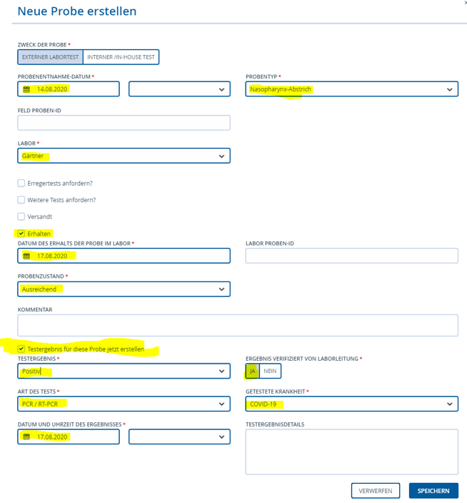

# Neue (Labor-) Probe erstellen

Nachem eine Person als "**Neuer Fall**" eingetragen ist, muss als nächstes das
Ergebnis der Labor-(bzw.Arzt)meldung unter „**Neue Probe erstellen**“ (den
Button findet man auf der rechten Seite unter dem Fall eingetragen werden.

Foto 1

Zu den Pflichtfeldern gehört hier

-   Auswahlt unter "**Zweck der Probe**" entweder "Externer Labortest" oder
    "Interner/in-house Test"

-   "**Probenentnahme-Datum**", an dem die Probe entnommen wurde

-   "**Probentyp**", in den meisten Fällen kann der vereingestellt
    "Nasen-Abstrich" als Routinetest verwendet werden, ansonsten die Angaben des
    Laborzettels übernehmen

-   "**Feld Proben-ID**", hier die Referenznummer des Labortests übertragen

-   "**Labor**", den Namen des durchführenden Labors auswählen

-   OPTIONAL: wenn unter „**Erhalten**“ ein *Haken gesetzt* wird, dann muss das
    "**Datum des Erhalts der Probe im Labor**" eingetragen werden und unter
    "**Probenzustand**" wird immer „ausreichend“ angegeben.

-   Unter der ersten Eingabemaske befindet sich ein Kästchen „**Testergebnis für
    diese Probe jetzt erstellen**“, dieses wird angeklickt um die Eingabemaske
    zu erweitern

-   Hier wird nun das "**Testergebnis**" entsprechend dem Befund als
    "**positiv**" oder "**negativ**" geändert

-   unter "**Ergebnis verifiziert von Laborleitung**" wird „Ja“ ausgewählt.

-   „**Art des Tests**“ ist in der Regel „PCR / RT-PCR“ oder
    "Antigen-Nachweistest (Schnelltest)" - andere Tests werden derzeit in Rahmen
    der Ermittlungsarbeit NICHT durchgeführt

-   "**Getestete Krankheit**" ist voreingestellt "COVID-19"

-   "**Datum und Uhrzeit des Ergebnisses**" werden vom Laborbogen übernommen.

Dann müssen die Angeben **gespeichert** werden.
