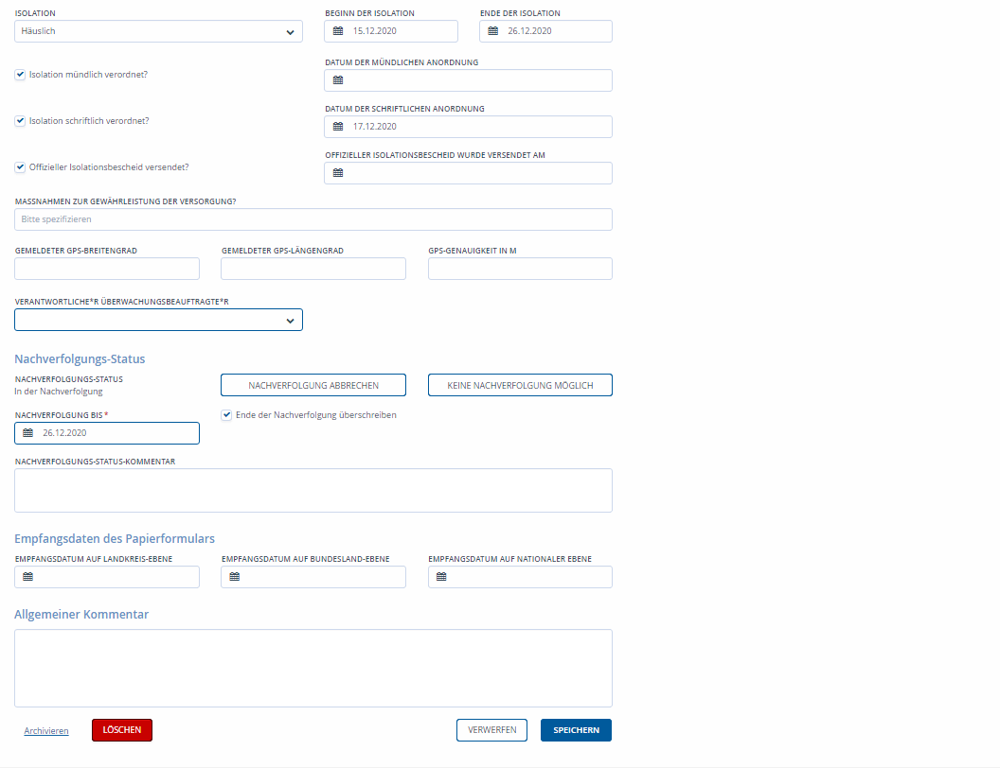
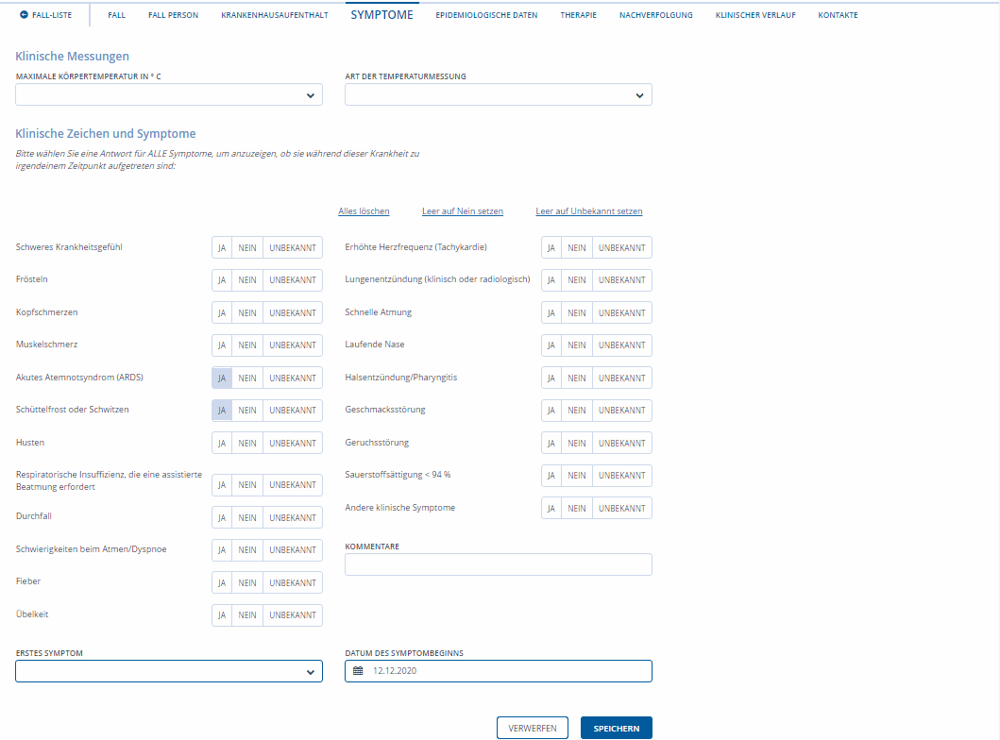
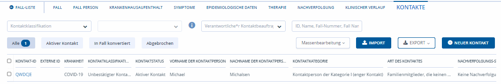
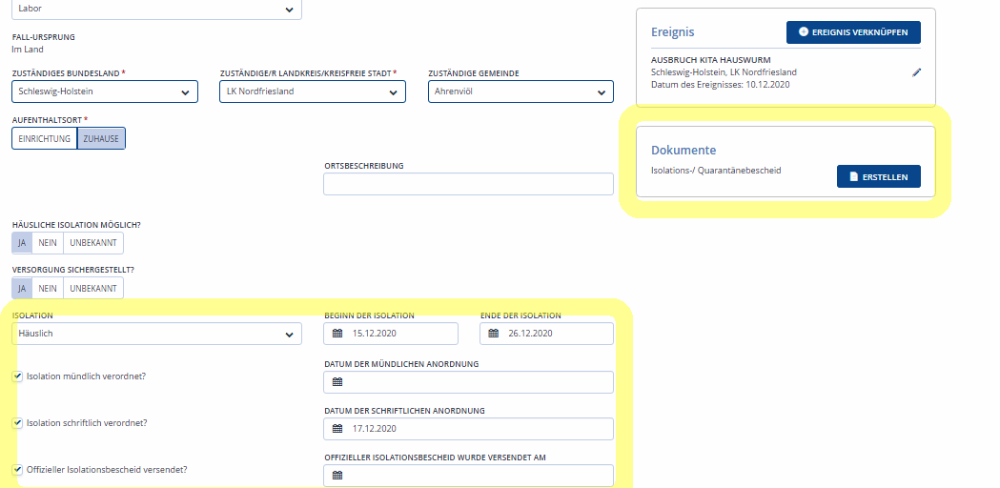
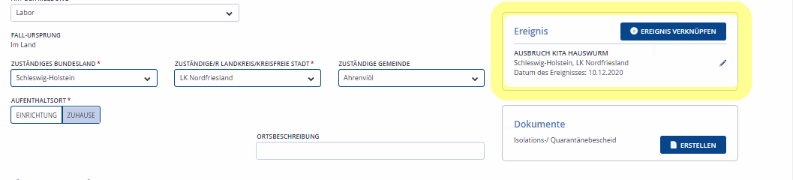
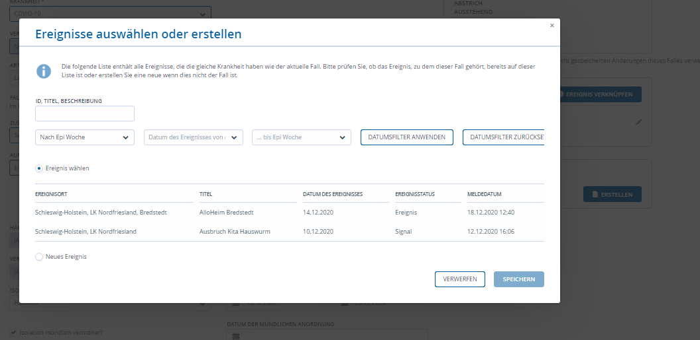
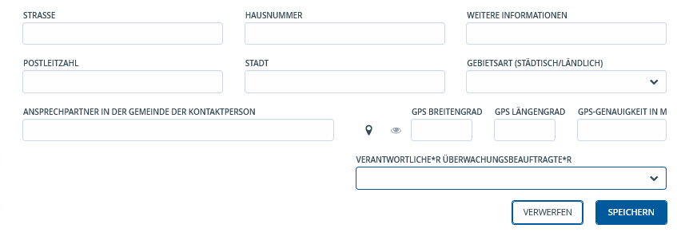

# Falleruntersuchung durchführen

### Aufgabe bearbeiten: Falluntersuchung

In der Falluntersuchung werden die von Hotline und Verwaltung angelegten Fälle
von Fallbeauftragten (Spezis) weiter bearbeitet und bewertet.

### Validieren

Dazu werden die in den Aufgaben beauftragten einzelnen **Fallebeauftragten**
oder dem **Team Fallbeauftragte** zugewiesenen Fälle weiter bearbeitet.

Im Anschluss wir die Aufgabe auf „Erledigt“ gesetzt.

## Falldaten

Foto 1: Übersicht Falldaten

| **Aufgabe Falluntersuchung: Anruf bei corona-positiv gemeldetem Fall durchführen**                                                                                                                                                                                                                                                                                                                                                                                                                                                                                                                                                                                                                                                                                                                                                                                                                                                                                                                                                                                                                                                                                                                                                                                                                                                                                                                                                                                                 |
|------------------------------------------------------------------------------------------------------------------------------------------------------------------------------------------------------------------------------------------------------------------------------------------------------------------------------------------------------------------------------------------------------------------------------------------------------------------------------------------------------------------------------------------------------------------------------------------------------------------------------------------------------------------------------------------------------------------------------------------------------------------------------------------------------------------------------------------------------------------------------------------------------------------------------------------------------------------------------------------------------------------------------------------------------------------------------------------------------------------------------------------------------------------------------------------------------------------------------------------------------------------------------------------------------------------------------------------------------------------------------------------------------------------------------------------------------------------------------------|
| \- Begrüßung: Mitteilen, dass man vom Gesundheitsamt ist - Abfrage Name der angerufenen Person (zur Sicherstellung, ob die richtige Person am Apparat ist) - Postives Testergebnis mitteilen - Symptome abfragen - Person in Isolation schicken (mündliche Isolation anordnenn, ankündigen das schriftlicher Bescheid per Email/Post folgt) Grundlage der Entscheidung für **Dauer der Isolation**: o MIT Symptomen: 14 Tage ab **Datum des Symptombeginn** o OHNE Symptome: 14 Tage ab **Datum des Abstrichs Weitere Information geben:** - Es erfolgt Aufnahme ins ambulante Monitoring: zukünftig wird sich täglich ein niedergelassener Arzt melden und den Gesundheitszustand erfragen - das Gesundheitsamt gibt die Kontaktdaten an die kassenärztiche Vereinigung (KVSH) weiter - KVSH teilt die Ärzte zu, das Gesundheitsamt hat keinen Einfluss darauf, welche/r Ärztin/Arzt zugeteilt wird - Bei Symptomverschlechterung: SORORT telefonisch 116 117 Hausarzt oder im Notfall, z.B. Atemnot, telefonisch die 112 (Rettungsdienst) benachrichtigen, dabei am Telefon **immer mitteilen**, dass es hier um einen Corona-positiven Menschen geht - Regeln der häuslichen Isolation erklären (mehr: <https://www.rki.de/DE/Content/InfAZ/N/Neuartiges_Coronavirus/Quarantaene/haeusl-Isolierung.html> Hinweise werden mit dem Bescheid zur Isolation versandt) - Es erfolgt normalerweise KEINE neuer Abstrich (Ausnahme: wenn kompliziertem Verlauf mit schweren Symptomen) |
| Ermittlung Kontaktpersonen: Ermittlungszeitraum: positiver Fall **MIT** Symptomen: **2 Tage vor Symptombeginn** positiver Fall **OHNE** Symptome: **2 Tage vor Abstrich** Fragen nach - Wer? (mit welchen Personen hatten Sie direkte Kontakte) - Wann? (Tag für Tag durchgehen) - Wie? (Lüftung? Abstand? Mund-Nase-Schutz/Maske?) - Wie lange? - Haushaltsmitglieder? - Aufforderung, die Daten sämtlicher Kontaktpersonen (Name, Adresse, Telefonnummer) per E-Mail zu übersenden: [infektionsmeldungen\@nordfriesland.de](mailto:corona-kpn@nordfriesland.de) – lange Listen nach Möglichkeit per Excel - Frage, wo wird die Ansteckung vermutet? Gab es ein besondere Ereignis an dem die Person sich angesteckt hat?                                                                                                                                                                                                                                                                                                                                                                                                                                                                                                                                                                                                                                                                                                                                                         |

**WICHTIG**  "Falldefinitionskategorie" erhalten immer alle **Fälle mit
positivem Laborergebnis die Falldefinitionskategorie C, D oder E** , da dieser
sonst in der Auswertung nicht als Fall gezählt werden kann.

| **Falldefinitionskategorien**    | **Kriterien**                                                                                                                       |
|----------------------------------|-------------------------------------------------------------------------------------------------------------------------------------|
| 0. nicht klassif.                | nicht klassifiziert                                                                                                                 |
| A. klin-diagnost.                | Nur symptomatisch, von Arzt/Ärztin gemeldet                                                                                         |
| B. klin-epidem. bestät.          | Patient/in mit Symptomen und Kontakt zu bestätigtem Fall; oder Teil einer Häufung von Fällen (Status nur nach Rücksprache vergeben) |
| C. klin-labor. bestät            | Symptomatisch und positiver Laborbefund                                                                                             |
| D. labor. ohne klin.             | Asymptomatisch und positiver Laborbefund                                                                                            |
| E. labor. und unbek. klin. Bild. | Unbekannte Symptomatik und positiver Laborbefund                                                                                    |
| X. kein Fall                     | kein Fall                                                                                                                           |

Fall „B. klin-epidem. bestät.“ Wird in den Fallzahlen auch mitgezählt! Diese
Kategorie darf nur nach Rücksprache mit Team verantwortlicher/em Ärztin/Arzt aus
der bzw. deren/dessen Vertretung vergeben werden.

"**Untersuchungsstatus**", bleibt in der Regel "Untersuchung ausstehend"

"**Krankheit**", voreingestellt ist "COVID-19"

"**Verlauf der Erkrankung des Falls**", auswählen zwischen "noch kein Ergebnis
bekannt", "verstorben", "genese" oder "unbekannt"

"**Aufenthaltsort**", auswählen zwischen "Einrichtung", dann öffnet sich ein
Untermenue mit den Auswahlmöglichkeiten "Einrichtungskategorie", "Art der
Einrichtung" und "Einrichtung" um die klinische Einrichtung zu spezifizieren in
der der Fall derzeit lebt; bzw "zuhause" was ausgewählt wird wenn sich die
Person in der Häuslichkeit aufhält

"**Isolation**", hier wird definiert an welchem Ort der Fall sich für die
Isolation aufhält

"**Beginn der Isolation**", Datum des ersten Tages an dem die Isolation des
Falles beginnt

"**Ende der Isolation**", Datum des letzten Tages bis zu dem Isolation
angeordnet ist

"**Isolation mündlich verordnet**", wenn dieses Kästchen ausgewählt wird öffnet
sich ein weiteres Feld zur Angabe des "Datum der mündlichen Anordnung"

"**Isolation schriftliche verordnet**", wenn dieses Kästchen ausgewählt wird
öffnet sich ein weiteres Feld zur Angabe des "Datum der schriftlichen Anordnung"

"**Offizieller Isolationsbescheid versendet**", wenn dieses Kästchen ausgewählt
wird öffnet sich ein weiteres Feld zur Angabe des Datum wann "Offizieller
Isolationsbescheid wurde versendet am"

"**Name der\*des verantwortlichen Ärztin/Arztes**", hier wird der Namen der\*des
Hausarztes/Hausärztin eingetragen

"**Telefonnummer der\*des verantwortlichen Ärztin/Arztes",** hier wird die
Telefonnummer der\*des Hausarztes/Hausärztin eingetragen

### Fall bewerten

Fall muss nach Handlungsanweisung bewertet werden. Diese muss noch erstellt
werden.

#### Fall Person

Fall Person

Hier werden unter dem Bereich "Erwerbstätigkeit & Bildung" Angaben gemacht zu

"**Beschäftigungsart**", welcher Kategorie von Berufstätigkeit der Fall
nachgeht, die FRAGE ist:

>   "*Was machen Sie beruflich?*"

WICHTIG sind hier Angaben zu machen wenn der Fall "**im Gesundheitswesen
tätig**" ist oder sich in "**Ausbildung**" befindet, da hier möglicherweise
weitere Personen, z.B. Patienten/innen, Mitschüler/innen, gefährdet sind.

#### Fall Symptome

Foto 2: Fall Symptome

Hier werden alle aufgetretenen Symptome abgefragt und entsprechen "Ja", "Nein"
oder "unbekannt" angekreuzt.

**WICHTIG** für die Falluntersuchung - und den Start des Datums der
Falluntersuchungen bei der Kontaktpersonennachverfolgung - sind die Angaben zum
"**Datum des Symptombeginn**".

Chronische Vorerkrankungen, bzw. Medikamente werden NICHT abgefragt.

#### Fall Kontakte

Im ersten Telefonat wird der Fall darauf hingewiesen, dass sie/er die
Kontaktpersonen der letzten 48h (vor Symptombeginn bei symptomatischen Fällen)
und regulär 48h ggf. bis 14 Tage - (bei asymptomatischen Fällen) - vor der
Testung angeben muss. In dem Telefonat und der anschließenden Mail mit dem
Kontakterhebungsbogen wird, wenn möglich, die Fall-ID mitgegeben, sodass eine
anschließende Zuordnung erleichtert wird.

Wenn möglich, sollten die Kontakte, die im selben Haushalt leben, sofort erfasst
und sofort unter Quarantäne gestellt werden.

Foto 3

Hier können bereits die im Rahmen der Ermittlungsarbeit ermittelten Daten zu
"**Kontakt**"personen zu dem Fall erhoben und eingefügt werden. Die Information
zu den einzelnen "**Kontakt**"personen und wie sie erhoben werden siehe unter
"Neuen Kontakt erstellen".

Im Rahmen der Kontaktpersonen Ermittlung können die Informationen durch die
Kontaktpersonen verifziert, bzw. überarbeitet werden.

#### Bewertung nach Falluntersuchung

Am Ende der Falluntersuchung kann für die "**Isolierung**" des Falles
entsprechend unter dem Reiter "Fall" die **Anordnung der Isolation mündlich und
schriftlich dokumentiert** werden und der **Isolationsbescheid erstellt (und
versendet)** werden.

Foto 4

Dazu werden einerseits die Angaben zur Isolation dokumentiert.

### Bescheid Isolierung erstellen

Und Abschließend durch Auswahl von "Erstellen" unter Dokumente,
Isolations-/Quarantänebescheid öffnet sich ein Untermenu aus dem entsprechend
die Bescheidvorlage, z.B. "Isolierung positiv" ausgewählt wird.

Foto 5

Nach Auswahl aus der Dokumentenvorlage der Bescheid ausgewählt und "erstellen"
ausgewählt wurde, wird das Dokument mit den Angaben zur Person wie Vor- und
Nachmane, Anschrift, sowie des Beginn und Enddatums der Isolierung automatisch
generiert.

**VERSCHICKEN EMAIL POST**

**ABLEGEN**

### Aufgabe erstellen: Übermittlung an KVSH

Die Kontaktdaten aller isolierten Fälle werden zur Einrichtung durch die
ärztlichen Überwachung an ärztliche Mitarbeitende der Kassenärztliche
Vereinigung Schleswig-Holstein (KVSH). Niedergelassene Ärzte/innen rufen nach
der Meldung an die KVSH isolierte Fälle täglich an um corona-typische Symptome
der Patienten/innen zu erfragen und ggf. weitere ärztliche Versorgung
einzuleiten.

Zur Zeit (Stand 22.12) werden die Kontaktdaten der isolierten Fälle händisch
online von einem Mitarbeitenden des GA NF eingetragen in die Datenbank der KVSH
unter:

<https://idp.serviceportal.schleswig-holstein.de>

Hierzu wird nach der Absonderung eines positive gemeldeten Falles in die
Isolierung durch die/den Fallerbeauftragte/n eine "Aufgabe erstellen" generiert
mit "Aufgabentyp" Fallverwaltung, dazu wird in den Kommentar zur Aufgaben
Übermittlung an KVSH eingetragen.

### Aufgabe erstellen: Übermittlung SurvNet/Landesstelle Kiel

Am Ende der Ermittlungen werden die Daten an die Landesstelle Kiel via SurvNet
übermittelt.

Die/der Fallbeauftragte führt die Übermittlung der corona-positiv gemeldeten
Fälle des gleichen Tages vor 20.00 Uhr durch

#### Bewertung Ereignis (Häufungen von drei und mehr Fällen)

Wenn im Rahmen der Ermittlungen festgestellt wird, das der Fall zu einem
"Ereignis" zugehörig ist, z. B. ein Ausbruchsgeschehen in einer Schule, Kita,
Alte-oder Pflegeheim, dann kann er durch die Auswahl "Ereignis verknüpfen" mit
diesem Ausbruchsgeschehen verknüpft werden.

Über Ereignisse können Personen die Teil einer Infektionskette sind im Rahmen
von lokalisierten Ausbruchsgeschehen zusammengefügt werden.

Foto 6

Dazu öffnet sich nach der Auswahlt dann ein Untermenu in dem der\*die
Ermittler/in entweder ein "**Ereignis auswählen oder erstellen**" kann.

Foto 7

In der Eingabemaske werden nun alle Informationen zu diesem Ereignis
eingetragen.

"**Ereignisstatus**", wird als "Ereignis" ausgewählt

"**Mehrtägiges Ereignis**" wird markiert/angekreuzt

"**Titel**", hier wird als Freitext eine aussagekräftige Überschrift für das
Ereignis hinterlegt, beispielsweise der "Weiteführende Schule Insel SZ", "Party
bei XY", "Fahrt im PKW zu ABC" eingetragen

"**Beschreibung**", hier wird eine kurze Beschreibung des Ereignis eingefügt

"**Bundesland**" bzw "**Landkreis/Kreisfreistadt**" sind voreingestellt als
"Schleswig-Holstein" bzw. "Nordfriesland". Diese Angaben werden entsprechend
geändert wenn das Ereignis außerhalb von Nordfriesland stattgefunden hat.

#### Teilnehmer/innen zu Ereignis hinzufügen

Ist das Ereignis erstellt bzw. ausgewählt, werden unter „Ereignisteilnehmer“ als
Teilnehmer/innen am Ereignis mit "Personen hinzufügen" mit dem Ereignis
verknüpft.

Sollte die Person, oder eine Person mit ähnlichem Namen, bereits in SORMAS
hinterlegt sein, geht ein Auswahlfeld auf indem man bestätigen kann ob es sich
um diese Person, oder um eine neue Person handelt. Im Anschluss kann man, bei
einer neuen Person weitere Angaben machen oder bei einer bestehenden diese
überprüfen und ggfs. aktualisieren.

**WICHTIG**: Personen, bei denen ein Kontakt zu einem Indexfall klar ist,
sollten zuerst über den Indexfall als Kontaktperson angelegt werden. Wird nun
der Name im Ereignis hinzugefügt, taucht die bereits angelegte Kontaktperson als
Vorschlag auf.

#### **Aufgabe für Mitteilungen Pressestelle**

Nach dem Erstellen eines Ereignisses muss eine Aufgabe erstellt werden die dem
Benutzer „MITTEILUNG Presse o.a.“ zugewiesen. Hierdurch wird die Pressestelle
bzw. andere Nutzer die zu dieser Benutzergruppe gehören, durch das GA NF über
Ereignisse in Einrichtungen wie Schulen, Kita, Alten-/Pflegeeinrichtungen,
Einrichtungen der Eingliederungshilfe oder ähnliche informiert.
