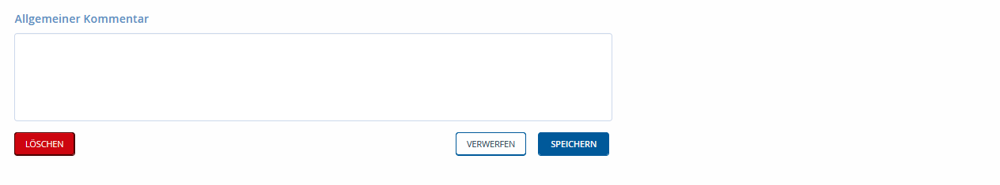

# Kontaktuntersuchung

Es gibt es verschiedene Möglichkeiten eine Kontakperson zu einem (Index)Fall
hinzu zu ordnen.

In der Regel werden bei der Falluntersuchung einer corona-positiv gemeldeten
Person von dieser andere Personen als Kontakt angegeben. Der im folgenden
beschriebene Arbeitsprozess beginnt daher hier bei dem Fall. Daneben kann einer
"Neuer Kontakt" unabhängig von einem Fall eingerichtet werden.

Bei einem positiv gemeldeten Fall werden die Kontaktpersonen der letzten 48h vor
Symptombeginn (evtl. bis zur Testung) ermittelt.

Wird ein asymptomatischer Fall positiv getestet, z.B. durch ein Screening, dann
können ggf. die Kontaktpersonen der letzten 14 Tage (Inkubationszeit) ermittelt
werden, ansonsten wird bis 48h vor der Testung ermittelt.

**Unbestätigter Kontakt**: Eine Person gibt an, Kontakt zu einem bestätigten
Fall gehabt zu haben, hat dies beim Gesundheitsamt gemeldet und eine
professionelle Klassifizierung ist noch nicht erfolgt.

**Bestätigter Kontakt**: Eine Person hat gesicherten Kontakt zu einem
bestätigten Fall gehabt.

**Kein Kontakt**: Eine Person hat keinen gesicherten Kontakt zu einem
bestätigten Fall. Beispielsweise auch Reiserückkehrer.

### Kontakt hinzufügen

Foto 1

Werden im Rahmen der Fallermittlung Kontaktpersonen angegeben, sollte unter
Menue "**Fälle**" unter dem Reiter „**(Fall)Kontakte**“ im entsprechenden
Indexfall ein „Neuer Kontakt“ angelegt werden.

| **KASTEN: Anruf zur Ermittlung bei gemeldeter Kontaktperson durchführen**                                                                                                                                                                                                                                                                                                                                                                                                                                                                                                                                                                                                                                                                                                                                                        |
|----------------------------------------------------------------------------------------------------------------------------------------------------------------------------------------------------------------------------------------------------------------------------------------------------------------------------------------------------------------------------------------------------------------------------------------------------------------------------------------------------------------------------------------------------------------------------------------------------------------------------------------------------------------------------------------------------------------------------------------------------------------------------------------------------------------------------------|
| \- Begrüßung: Mitteilen, dass man vom Gesundheitsamt ist - Abfrage Name der angerufenen Person (zur Sicherstellung, ob die richtige Person am Apparat ist)                                                                                                                                                                                                                                                                                                                                                                                                                                                                                                                                                                                                                                                                       |
| **Fragen im Rahmen der Kontaktpersonenermittlung:** - Wer? ( hatten Sie direkten Kontakt mit dem Fall/Indexperson, Abgleich mit den Angaben des (Index)Falles) - Wann? (Ereignis durchgehen) - Wie? (Lüftung? Abstand? Mund-Nase-Schutz/Maske?) - Wie lange? - waren noch andere Personen anwesend? (Ergänzung der vom Fall übersendeten Informationen) - Aufforderung, Daten weiterer Kontaktpersonen (Name, Adresse, Telefonnummer) per E-Mail zu übersenden: [infektionsmeldungen\@nordfriesland.de](mailto:corona-kpn@nordfriesland.de) – lange Listen nach Möglichkeit per Excel - Frage, wo wird die Ansteckung vermutet? Gab es ein besondere Ereignis an dem die Person sich angesteckt hat?                                                                                                                             |
| Kontaktperson in häusliche Absonderenung ("Quarantäne") schicken (mündlich Anordnen, schriftlicher Bescheid folgt) - Zeitraum: 14 Tage ab letztem Kontakt mit dem positiven Fall - Regeln der Quarantäne erklären (mehr: <https://www.rki.de/DE/Content/InfAZ/N/Neuartiges_Coronavirus/Quarantaene/Inhalt.html> ; Hinweise zur häuslichen Quarantäne werden mit der Quarantäneverfügung versandt) - Fieber messen, Tagebuch führen (sofern kein Fieberthermometer vorhanden: Angebot Übersendung durch Gesundheitsamt) - Mitteilung: Wenn Symptome auftreten, dann ist Corona-Test möglich, Abstrich bei Hausarzt/ärztin oder über Gesundheitsamt) - Hinweis: falls Symptome auftreten, umgehende Meldung an das Gesundheitsamt; Hotline 0800 200 66 22  - Möglichkeit, den Ort des Abstriches zu erreichen, klären (kein ÖPNV)  |

In der Eingabemaske werden alle vorhandenen Informationen zu einem Kontakt
eingetragen. Dabei sind relevant

"**Kontaktklassifikation**", dabei muss ausgewählt werden ob dieser als
"unbestätigter Kontakt", "bestätigter Kontakt" oder "kein Kontakt" klassifiziert
ist. Die Kontaktklassifikation ist auf „Unbestätigter Kontakt“ gesetzt. Sobald
der Kontakt durch Ermittlungen bestätigt oder widerlegt wurde wird die
Kontaktklassifikation dementsprechend angepasst.

"**Datum des letzten Kontaktes**", **WICHTIG**, da hiervon die zukünftige Dauer
der Quarantäne abhängig ist.

"**Krankheit des Indexfalls**" ist voreingestellt as COVID-19

"**Meldedatum**" definiert wann die Kontaktperson dem Gesundheitsamt gemeldet
wurde

"**Zuständiges Bundesland**" bzw "**Zuständige/r Landkreis/Kreisfreistadt**"
sind voreingestellt als "Schleswig-Holstein" bzw. "Nordfriesland". Diese Angaben
werden entsprechend geändert wenn der Kontakt an ein Gesundheitsamt in einem
anderen Bundesland bzw. Kommune abgegeben wird.

"**Art des Kontakte**s", hier wird durch Auswahl der entsprechenden Art des
Kontaktes automatisch ermittelt zu welcher Kategorie die Kontaktpersonen (KP1,
KP2, …) es sich bei dem Kontakt handelt.

#### Quarantänebescheid erstellen. WICHTIG!

"Quarantäne", hier muss ausgewählt werden wo die Quarantäne verbracht wird. Wenn
"Häuslich" oder "Institutionell" ausgewählt wird, kann ein
**Quarantänebescheid** (per Sidebox DOKUMENT erstellen) ausgestellt werden -
dazu müssen die Angaben zum Kontakt einmal **GESPEICHERT** werden.

"**Quarantäne Beginn**" bzw "**Quarantäne Ende**", müssen als Datum eingefügt
werden damit diese Termine in den Quarantänebeschied übernommen werden konnen.

In diesem Arbeitsschritt muss durch auswählen/ankreuzen dokumentiert werden ob
die

**"Quarantäne mündlich verordnet?"**

**"Quarantäne schriftlich verordnet?"**

worden ist.

### Qurantäne Zeitraum anpassen

Wenn der Quarantäne Zeitraum individuelle an Umstände die sich während der
Kontaktpersonennachverfolgung ergeben haben angepasst soll, dann kann in dem
Bereich Nachverfolgungs-Status unter

"**Ende der Nachverfolgung überschreiben**" das dazugehörige Feld
angekreuzt/aktiviert UND unter

"**Nachverfolgen Bis**" entsprechend das Datum auf 10 Tage nach Einreisedatum
angepasst werden.

Die individuelle Nachverfolgung quarantänisier tKontaktpersonen findet derzeit
(Stand 23.12.2020) aufgrund begrenzter Personalkapazitäten nicht statt. Die
Kontaktpersonen werden während der Ermittlungen informiert ein
**Symptomtagebuch** zu führen und bei coronatypischen Symptomen mit ihrem
Hausarzt Kontaktaufzunehmen - der dann entsprechend einen Coronatest mit PCR
durchführt.

Es ist geplant das quarantänisierte Kontakte zukünftig auch das digitale
Symptomtagebuch CLIMEO nutzen können um ihre Symptome dem GA NF mitzuteilen.

#### Kontaktperson in Fall konvertieren

Sobald eine bestätigte Kontaktperson, die sich aktuell in Quarantäne befindet
symptomatisch wird muss der Kontakt in einen Fall konvertiert werden.

Foto 2

Im folgenden öffnet sich ein "Neuen Fall erstellen" Fenster mit den Daten die
bereits zu dem Fall erhoben und dokumentiert wurden. Die Angaben können dann zu
dem Neuen Fall ergänzt werden.

Im Anschluss wird eine "Neue Aufgabe" für „Fallermittlung“ erstellt und in das
Kommentarfelg geschrieben, dass es sich um eine Kontaktperson handelt, welche
Symptome entwickelt hat. Zu dem dann neuen Fall werden dann Symptome und alle
weiteren Angaben ergänzt.
